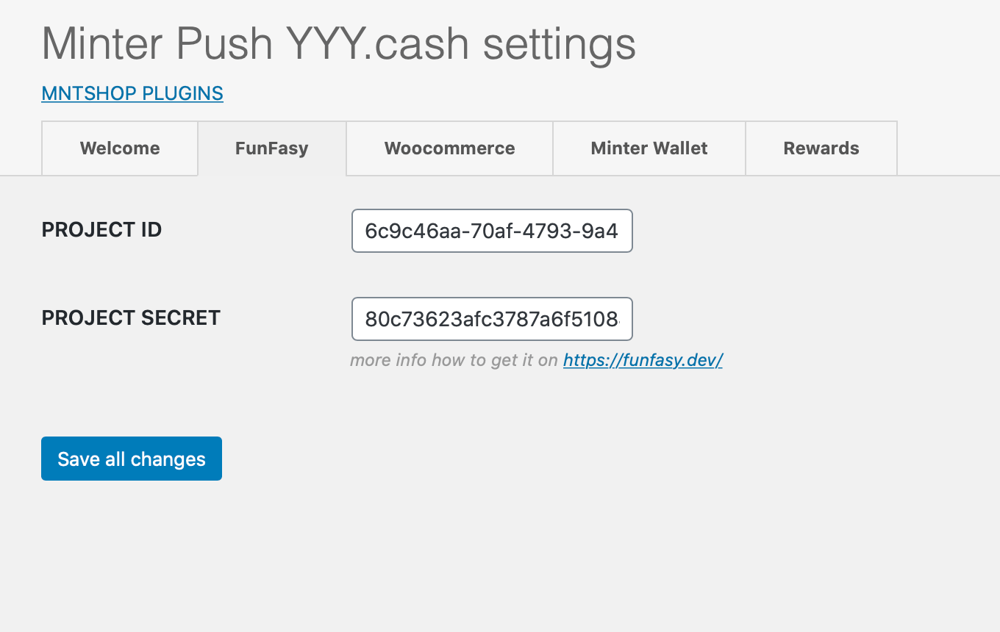
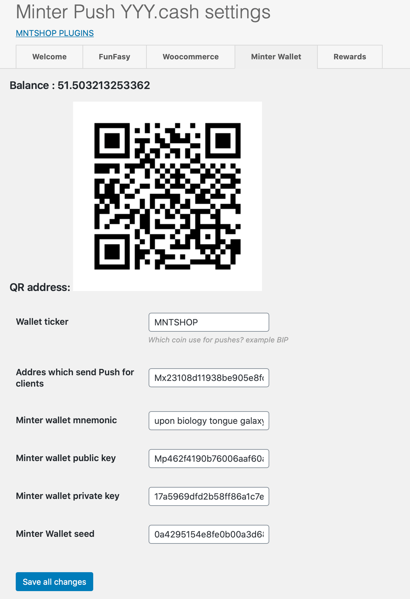
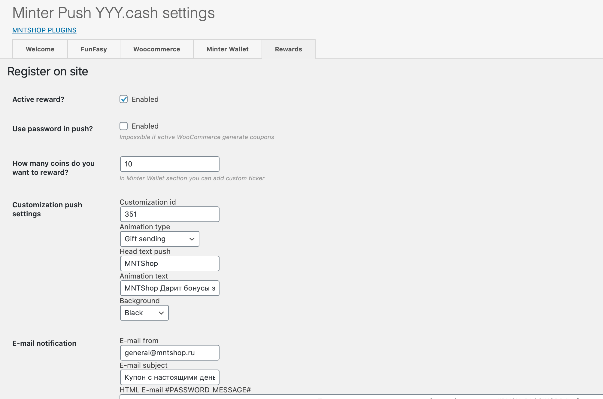
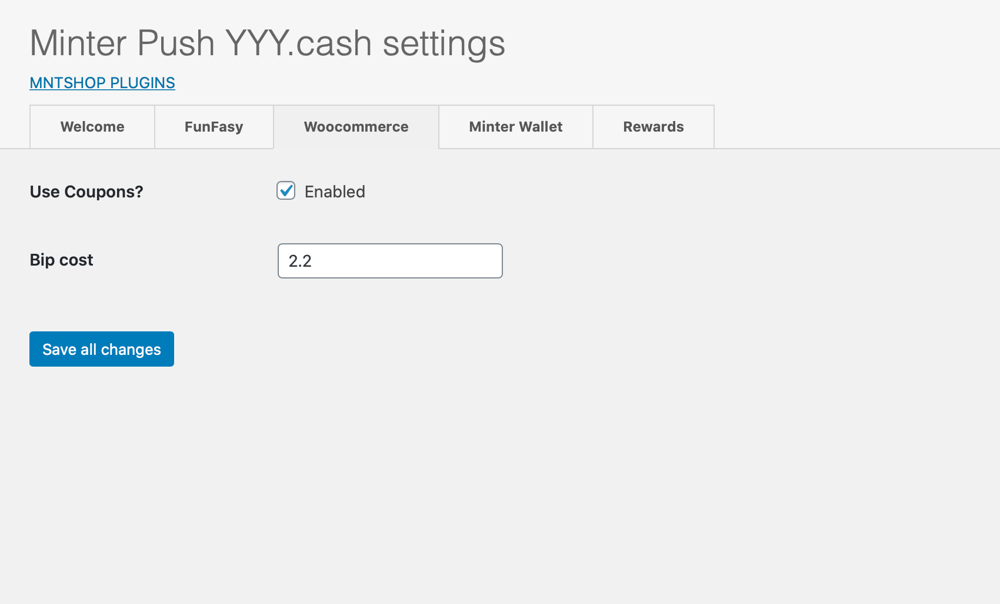

[README на РУССКОМ](README_RU.md "README_RU.md")
## MINTER_YYY_CASHBACK ##

Plugin created for ` #MinterPush 0.2 – Rewards Hackathon–Subscriptions`
EVERY question about this plugin asked here [Official Telegram group](https://t.me/mntshop_official_group "https://t.me/mntshop_official_group")  would be answered.

## Description ##

Wordpress Plugin gives you the power of rewards your client! example for registration.
 Use FunFasy.dev to send minter transaction and YYY.cash to generate containers with money.

## Installation ##

1. Just download and put it in your plugin folder
 `/wp-content/plugins/minter-yyy-cashback` .
2. Activate the plugin through the 'Plugins' list in WordPress
3. Setup plugin in `/wp-admin/options-general.php?page=minter-yyy-cashback` (or find in main menu Settings->Minter Push settings)

### In plugin settings ###

#### FUNFASY Settings section ####

Register at https://funfasy.dev/ and get your API keys and input your:
`PROJECT ID`
`PROJECT SECRET`

#### Minter Wallet Settings section ####
>When you install a plugin that generates a new empty wallet to send rewards.

Input your ticker here. All generated rewards will be sent in that ticker.

The balance would be displayed in the ticker 

>Also in this section contain all information about wallet. Such as wallet mnemonic phrase, just copy and paste in your wallet app for example here [BIP Wallet](https://wallet.bip.to "BIP Wallet"). And you can administrate wallet your new wallet.

#### Reward events Settings section ####
>In this section we have all predefined events like `Register on site `. You can customize it, but first, activate and some setup.

Available options:
- Active (Activate reward)
- Generate password (If you want to generate random password for reward)
- How many coins do you want to reward? (how many coins will be sent for this reward)
- Customization push settings (Customize reward)
- Email notification settings (Customize Email notification such as from, template and some conditional message)

>Feel free to use default settings like a template 

#### Woocommerce Settings section ####

>In this section store params for woocommerce.

Available options:
- BIP cost ( First of all tell the plugin how many cost BIP in your local currency )
- Coupon generate ( You can activate coupon generator. After activated all rewards will generate woocommerce coupons basically on BIP cost )
 

## Frequently Asked Questions ##

### Which services do you use? ###

We use:
 * FunFasy api to connect Minter Blockchain here more info [FunFasy](https://funfasy.dev/ "https://funfasy.dev/")
 * YYY.cash api to generate containers with money here more info [YYY.cash](https://push.money/swagger "https://push.money/swagger")

### What about woocomerce? ###

Currently, you can create cupon with minter push id and also add your price for BIP.
 That means when push creates woocommerce generate a coupon with a fixed discount with the amount in a push.

## Changelog ##

### 1.0 ###
* Add language: Russian.
* Add support to generate coupons. 
* Add FunFasy_helper (send transaction) .
* Add YYY_push (the object that has all info about the push and working with it).
* Add Admin Interface.
* Add New Post type: minter-push. (You can view all generated pushes)

## Upgrade Notice ##

### 1.0 ###
First version
